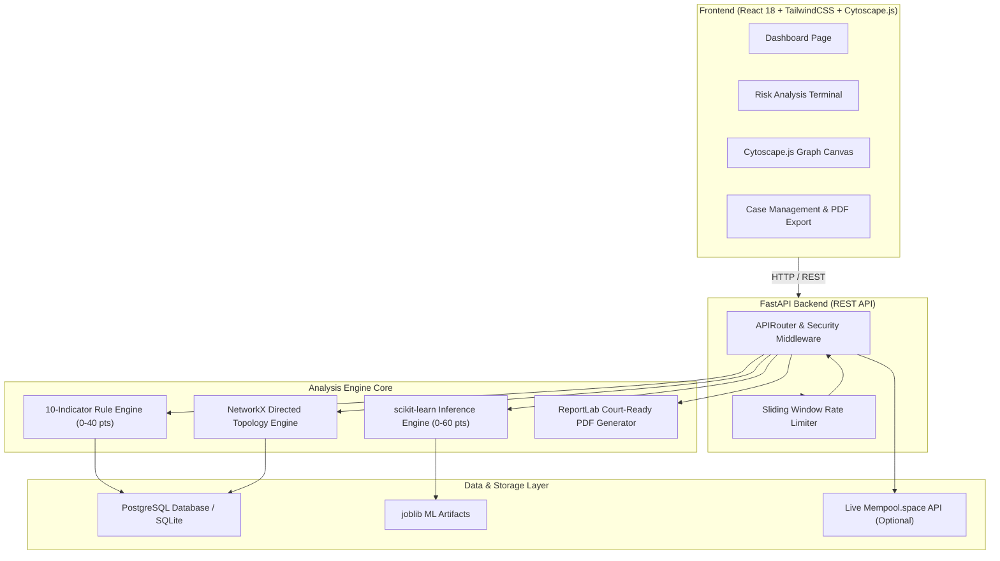

# ChainSentinel System Architecture

## Architecture Overview
ChainSentinel is designed as a decoupled, multi-tier cyber intelligence architecture.

---

## Core Components Breakdown

1. **Frontend Presentation Tier**:
   - Built with **React 18**, **TypeScript**, **Tailwind CSS**, and **Lucide Icons**.
   - Interactive directed graph canvas powered by **Cytoscape.js**.
   - Server state management handled via **TanStack React Query**.

2. **FastAPI Application Tier**:
   - Asynchronous Python web backend with automatic Pydantic request/response validation.
   - Per-client IP sliding window rate limiting.
   - Dynamic OpenAPI `/docs` toggling via `ENABLE_DOCS` environment variable.

3. **Analytics & ML Engine**:
   - **Rule Engine**: Computes deterministic behavioral risk indicators (Rapid Forwarding, Fan-out, Peeling Chains, Structuring, Dormancy Bursts, etc.).
   - **ML Baseline**: Combines `RandomForestClassifier` (supervised risk probability) and `IsolationForest` (unsupervised anomaly detection) with graceful rule-only fallback.
   - **NetworkX Graph Engine**: Calculates directed graph metrics (In/Out Degree, PageRank, Cycle Detection, Capped Node Capping).

4. **Persistence & Data Layer**:
   - **PostgreSQL / SQLAlchemy**: Entities (`Address`, `Transaction`, `Alert`, `Case`, `CaseNote`, `AnalysisRun`, `AuditLog`).
   - **PDF Generation**: Native binary `%PDF-` generation via **ReportLab**.

---

## Composite Risk Score Normalization & Aggregation Formula

The composite risk score ($C \in [0, 100]$) is a 100% reproducible, bounded prioritization score calculated from three sub-engines:

$$\text{Composite Risk Score } C = \min\left(100, \text{round}\left(\text{RuleScore}_{[0\text{-}40]} + \text{MLScore}_{[0\text{-}35]} + \text{GraphScore}_{[0\text{-}25]}\right)\right)$$

### 1. Rule Engine Sub-Score ($R \in [0.0, 40.0]$)
- Sum of score contributions from 10 deterministic behavioral heuristic rules (Rapid Forwarding, Fan-out, Fan-in, Peeling Chains, Dormancy Bursts, Circular Flows, Structuring, Risky Neighbor Exposure, Amount Anomalies, High Velocity).
- Capped at 40.0 points maximum:
  $$R = \min\left(40.0, \sum_{i=1}^{10} \text{RuleScore}_i\right)$$

### 2. ML Baseline Sub-Score ($M \in [0.0, 35.0]$)
- Supervised risk probability output from `RandomForestClassifier` ($P_{\text{risk}} \in [0.0, 1.0]$):
  $$M = \text{round}(P_{\text{risk}} \times 35.0, 1)$$
- **Fallback Mode** (if model artifact is missing):
  $$M_{\text{fallback}} = \text{round}\left(\frac{R}{40.0} \times 35.0, 1\right) \quad (\text{Flagged with } \texttt{is\_ml\_fallback = True})$$

### 3. Graph Engine Sub-Score ($G \in [0.0, 25.0]$)
- Derived from unsupervised `IsolationForest` anomaly score ($A_{\text{score}} \in [0.0, 1.0]$) and directed NetworkX topology metrics (PageRank, simple cycles, shortest distance to flagged clusters):
  $$G = \min\left(25.0, \text{round}(A_{\text{score}} \times 15.0 + \text{GraphCentralityBonus}, 1)\right)$$
- **Fallback Mode**:
  $$G_{\text{fallback}} = \text{round}\left(\frac{R}{40.0} \times 25.0, 1\right)$$

### Risk Level & Category Classification Matrix
- **CRITICAL** ($C \ge 75$): Immediate freezing protocol & multi-hop graph expansion required.
- **HIGH** ($50 \le C < 75$): Prioritize human analyst triage and trace funding origin.
- **MEDIUM** ($25 \le C < 50$): Flag for standard periodic monitoring.
- **LOW** ($C < 25$): Standard transaction flow; low risk.

